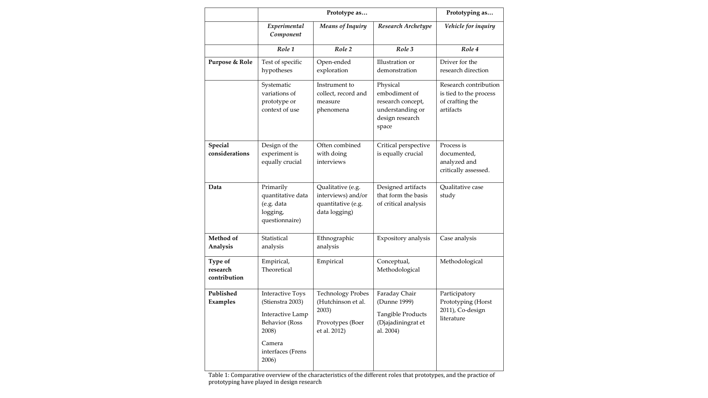
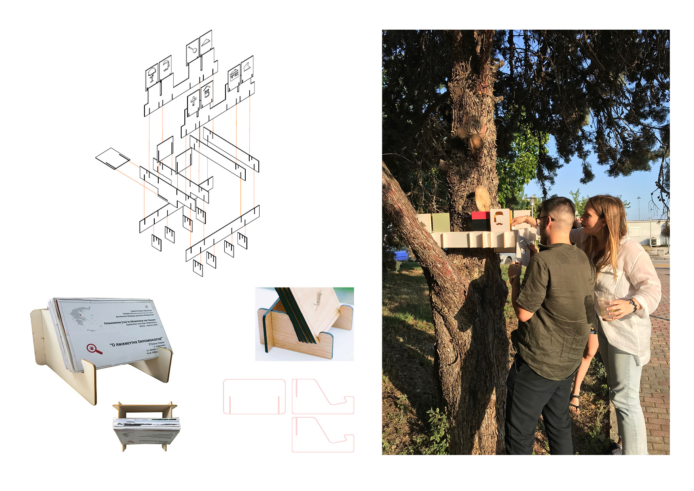
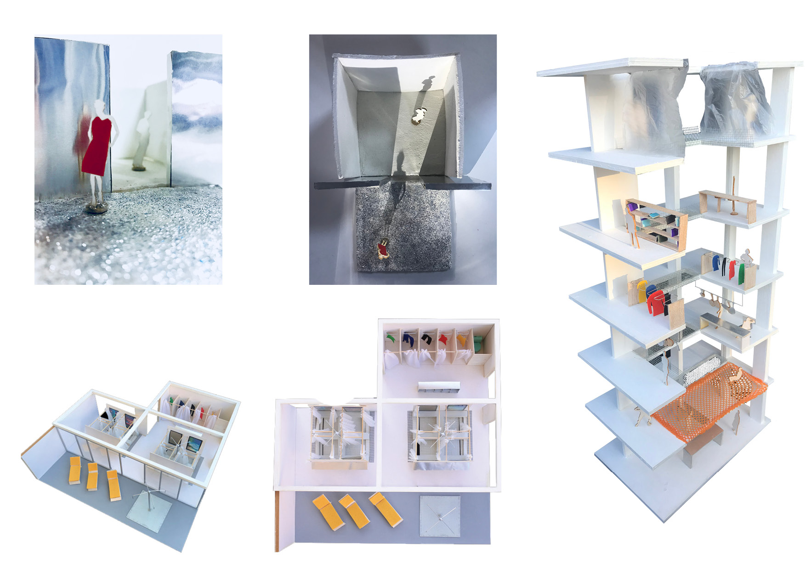
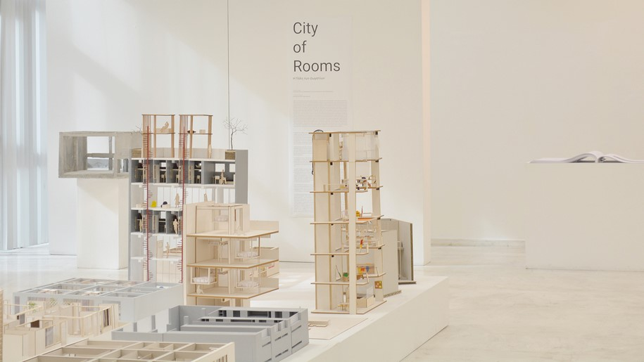
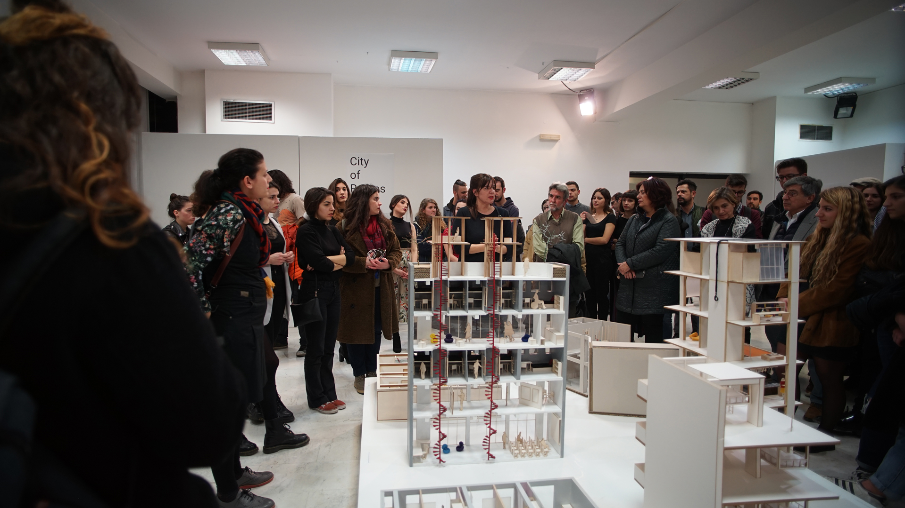

**Role 1**: The prototype as an experimental component  
Prototyping the design itself

**Role 2**: The prototype as a means of inquiry  
Prototyping objects that will later contribute / form the design.  
Instruments to collect, record and measure phenomena

**Role 3**: The prototype as a research archetype
e.g. showroom, exhibition, interactive process that gives information about the development

**Role 4**: The process of prototyping as a vehicle for inquiry  
Prototyping as a research method  
e.g. participatory workshop  
  

Taking a look back to my experience in design, I recall using some of the above roles of prototyping mostly during my studies in architecture. I was not used to the term 'prototyping' but while processing the meaning its potential roles, I have several experiences that match the categories.  

## Role 1
The **role 1**, which is maybe the most self-referential role, has not been one of my main practice tools since the projects I worked were usually in a non-prototypable scale. Nevertheless, at the 3rd year of my studies I participated in an extracurricular workshop for the design and manufacture of wooden benches in the exterior of the university. During the manufacturing process we tested the materials, the dimensions and proportions of the wooden planks, the amount and place of screws and other practical details. We were able to get instant feedback from the people passing by and test its durability before the final assembly.  
Another experience of working with the 1st role was within the course "NARRATIVE TRAILS: Designing [for] the Pelion hiking trails". The course was about mapping of a thematic route and design and construct an outdoor small-scale intervention. Our intervention turned out to be a game assembled by hands with all its pieces made out of cardboard. Along the process we tested multiple different sizes and versions of the game (board, floor, wearable) with the help of our class. We ended up 'wrapping' the game around tree trunks: it consisted of cards with figures designed by a local artist and the goal was to place the cards in the right positions according to the hints. The passengers could play while taking a break from their hike and at the same time get useful information about the culture of the trail.  
http://www.arch.uth.gr/en/studies/course/1811/8
  

## Role 2
For my thesis project I used the **role 2** of prototyping in order to collect more information about the city. The biggest part of the project was research, as we were dealing with much complex areas (archaeology, cement factory, forest department and more). Not knowing yet what was the purpose of the project or what it was going to look like, we created a questionnaire in order to collect more data. We knew the issues that we wanted to address, but not the actual purpose of our design so we wanted to know the public's views on the matter. Our topic was the environmental crisis, so we took advantage of a public demonstration happening on a specific day and went in the streets with 200 printed questionnaires, asking people to participate. The project took a radical turn which was indirectly related to the outcomes of that day.  

Another experience of working with the 2nd role was within the course "Structural [Trans]-Formations". The course objective was to explore the structural concept of a ‘lightweight’ structure that will host a performance event. The course attempted to approach the structural concept as a design resource and investigate the physical model as a tool for diagrammatic reasoning. The study was systematically recorded in the form of a digital diary (blog) in order to demonstrate alternatives and justify final choices.  
http://www.arch.uth.gr/en/studies/course/1774/7  

## Role 3
Due to my background I have worked in several physical and digital models, which would match the **role 3** of prototyping, the research archetype. From the first to the last year of my studies and my professional experience I got involved in multiple types of modelling:  
_ working models; made out of inferior materials (foam, paper, cardboard) and simple tools (cutter, scissors, pencils) which mainly served the purpose of shaping the volume.  
_ concept / interpretative models; made out of all kinds of materials and colours (from glitter to coffee beans) which were used as mediums to communicate the concept / story / idea.  
_ final models; carefully made with high quality materials (plexiglass, balsa, grass, puppets) and tools (laser cutter, 3d printers,..).  

In the 5th year of studies, within the Design Studio "City of Rooms" we curated an exhibition in a public gallery presenting the projects of the students. The exhibits were multikind (drawings, models, concepts, videos) and later became objects of discussion among the visitors: professors, students, student's families and all the public participated in the discussion. As the exhibition took place in the middle of the semester, we then had the chance to use the feedback in to further developing our designs.  
https://www.archisearch.gr/press/exhibition-volos-city-of-rooms/

  

## Role 4
Finally, my experience in the **4th role** is yet to come. I am very intrigued by the idea of using the prototyping process as a means to generate knowledge, but I haven't had the chance to use it before. Given the fact that I am interested in collective/embodied design experiences, the idea of a participatory workshop or action that could enlighten the design sounds alluring.

Without a doubt the city of Barcelona can offer endless opportunities for such experiments so I am
looking forward to use them with the MDEF group and other unexpected participants.
