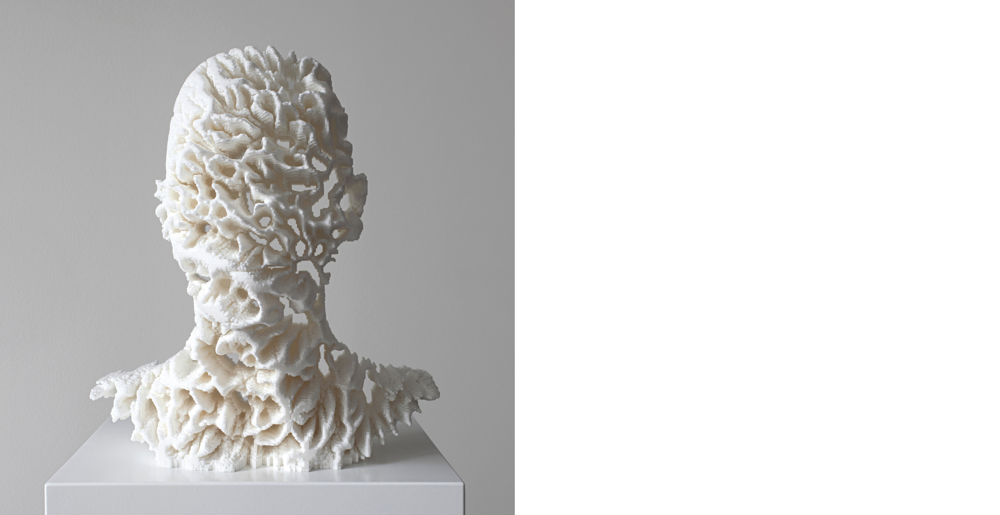

---
hide:
    - toc
---
# about

  
*Less human, more being*  

Myrto - Eirini Pappa   |   Μυρτώ - Ειρήνη Παππά   
- Architect in re-dis-covery  
- Researcher of how to survive the 9-5 nightmare    

Areas of interest:  
- post natural environments  
- augmented creativity  
- new ecologies: Dissolving the nature - culture binominal  
- essentialism  
- alternative intelligences  

*soon to be called :  
- an alumni  
- an advocate

[click](https://issuu.com/myrtopappa9/docs/portfolio) to view my past life architecture and urban design portfolio
