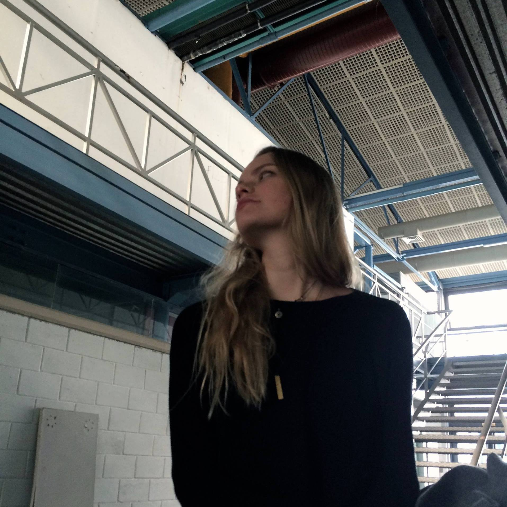

# About

Myrto-Eirini Pappa

Two personalities or just a way to keep both of my grandmas happy

Architect in recovery

Researcher of how to survive the 9-5 nightmare

Currently exploring the boundaries of Design

Areas of interest:

- post-natural environments

- new ecologies: Dissolving the nature / culture binominal, queer ecologies

- Future past

- Subconscious intelligence (SI)

*soon to be called :

- an alumni

- an advocate
