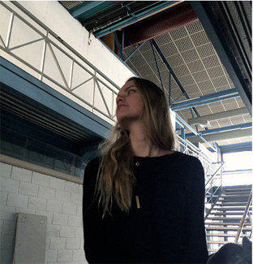

---
hide:
    - toc
---
# About

Myrto - Eirini Pappa   |   Μυρτώ - Ειρήνη Παππά  

Architect in (re)dis-covery  
Researcher of how to survive the 9-5 nightmare    

*Less human, more being*  

Areas of interest:  
- post natural studies  
- augmented reality  
- new ecologies: Dissolving the nature / culture binominal, queer ecologies  
- future past  
- subconscious intelligence (SI)  

*soon to be called :  
- an alumni  
- an advocate

[click](https://issuu.com/myrtopappa9/docs/portfolio) to view my past life architecture and urban design portfolio
