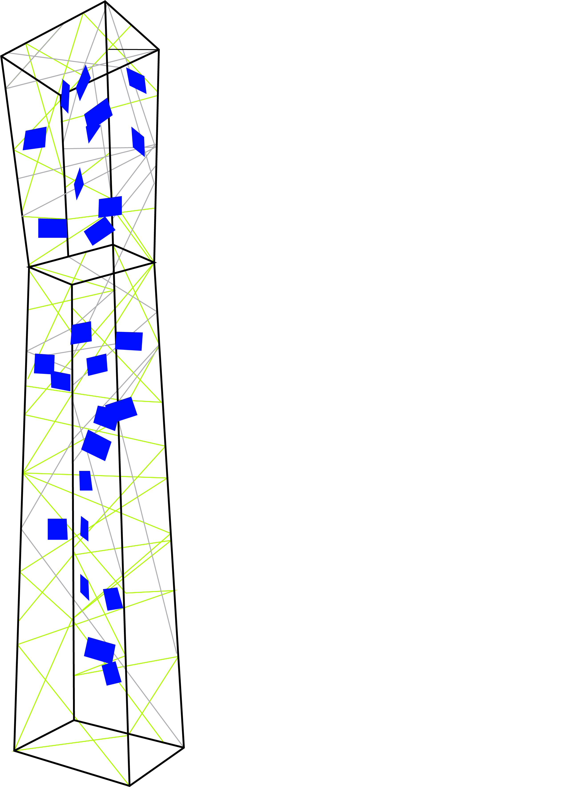
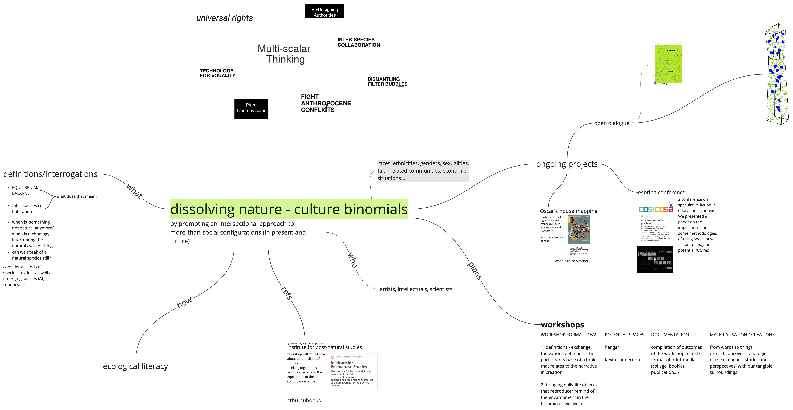

## storyline    
Starting with the master program, my readings and interests were in creating alternative narratives through storytelling about the romanticised idea of nature, the ancestor worship and post-humanism. Topics that were the core manifestations of my architecture thesis project.   
Not knowing what my first fight should / would be about, I tried to demonstrate through the poster the confusion I felt living in this complex, interconnected environment in a more generalised way. I was concerned about the paradoxes and misconceptions of the contemporary ecological approach: our relationship with the waste we produce, the food we consider ethical and not, the deification / apotheosis of nature. It was an expression of opposition with a dose of irony.  

However, I was seeking for new interests, new areas to explore during the first term as it seemed like the perfect, unique opportunity for me to do so. Soon I came across other types intelligences in nonhuman species (spider web -> extended intelligence, Portuguese man of war -> collective intelligence), altered states of consciousness, embodied cognition and psychedelic therapy.  
I followed those interests by experimenting with several activities such as ecstatic dance, hermetic spirituality lectures, yoga practices, the “brains” exhibition at the CCCB, my time-zero 24h challenge at the ’living with your own ideas’ seminar. Alongside I read articles, listened to podcasts, contacted people. While investigating the altered states I connected with a death coach: a person who prepares people for dying. Her work inspired me a connection of loss in human life with the loss of nature. We got to have an online interview which was very intersting.  

Somewhere along the way I discovered I shared interests with my friend and classmate Stella, so we began to timidly join our paths. We developed together a more extensive research about post-nature and speculative fiction through storytelling that enriched our list of references. We explored theories such as the mesh (@Timothy Morton), anthropocene - capitalocene - cthulhucene (@Donna Haraway, @Anna Tsing Lowenhaupt, @Bruno Latour), feralisation (@Anna Tsing Lowenhaupt), carrier bags (@Donna Haraway), the Gaia-theory (@James Lovelock) and more.  
With our ever-growing theoretical framework, we created a new design space which we then tried to apply by translating them into questions for the public. In the design dialogues week we created a mesh-type installation with our questions and a QR code leading to the platform of our [open dialogue](https://etherpad.wikimedia.org/p/fLhhX-gQcpsCZCb0Ckj3).   
   
Other application methods we are currently working on:
- cartographies: a collective mapping technique to practice in case-studies
- conferences: we are taking part in the Esbrina Research Group [conference](https://esbrina.eu/en/portfolio/imaginar-mundos-posibles-potencialidades-limites-y-fricciones-de-la-ficcion-especulativa-en-la-investigacion-y-la-educacion-3/), which has inspired us the idea of organising our own conference in Barcelona.
  
- workshop format ideas:  
i) definitions - exchange the various definitions the participants have of a topic that relates to the narrative in creation  

ii) bringing daily-life objects that reproduce/ remind of the encampment in the binominals we live in  

...more is coming..  

## reflecting // reframing   
`Goals: Critically look back at your project, reflect on the feedback from the Design Dialogues, and propose a new scope, goals and next steps.`  

- **abstract ideas are not easy to materialise**   
My thoughts have been quite vague and abstract during the first term. This opened many new pathways of collaboration with different people and exploring multiple fields. However, when the time came to translate these ideas onto the real world and practice experiments, things were challenging. It felt like any idea put into practice costed some loss in the meaning of it, or takes to other, non intended paths. For instance, the 'augmented creativity' group was formed with the goal of exploring *altered states of consciousness* and creating non-human experiences. Our intervention at the mocap room turned out to be more of a spiritual activity, which was not part of our initial plan. Even though abstract concepts cannot be easily solidified, I found value in applying fast-paced tests, even if they do not seem to perfectly fit all the objectives.  

- **simple and effective creations hide a mess**
This has been part of my design experience already but it is always a surprise to see it happening again.
For the design dialogues we had this idea of building a mesh with wires/fibers and then hang on them the cards with our questions. We started building it in 2D in order to make it more easy and readable but only after having spent some hours of 'pointless' weaving did we realise this does not work well.

- **not everything has to make sense**   
I have always been spending much time thinking what - why - where - how before I started getting my hands dirty. Partly because in my previous institution there had to be a very strong and concrete answer to all thy *whys* one could possibly ask about a project. *why this and not that, why now and not then, why here and not there* and so on. The problem is that when trying to respond to all of this, the creativity process can be blocked, cut off in its roots. That is why I always find it extremely hard to begin practicing. especially when I have a white, empty canvas in front of me, waiting for my creations to fill it in. What has proved helpful at this point is collaborating. Οther people's involvment can help significantly to kick-off without further procrastinating and overthinking.  

## design space ii  

  
