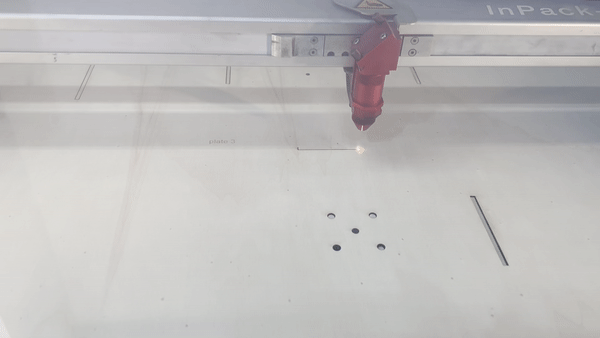

As an architect I have used the laser cutter quite a lot in the past years, both within my studies and in my proffessional experience.   
I never used it though for other than urban, landscape, or architectural models. It was very interesting to me to discover the possibilities of these machines, beyond the limitations of this field. Prototyping and physical modeling (maquettes) are two very different approaches: In the first case, the model is nothing but a interpretative simulation of the 'real' project: different scale, different materials, different functions. On the other hand, prototyping / iterating has a much more direct relationship with the project. It is the project itself. ok, maybe still quite far from the end goal or the initial idea, but still, more tightly connected to its origin. For example, it was the first time I used the laser cutter in a 1-1 scale. First time I did not have to convert x meters to a 1:20 or a 1:50 scale while preparing the laser file! 

Here are two examples of what I got to cut in the machine so far.  

## press-fit  

  

during the first microchallenge week, together with my team Amanda and Seher we decided to build quite a complex and ambitious tool for storing data (audio) on objects (cups). For that we had to employ multidisciplinary design tools: ideating & storytelling, electronics and coding, engeneering, digital fabricating. The part that needed to be designed and fabricated from scratch was the turning table, which would rotate the cup as a pen carved sounds graphs on its outter surface. our only guidance in terms of dimensions was of the aluminum framework and the motors that we borrowed (!) from an old, broken 3D printer.  

We used the press-fit technique to secure the stability of the structure, therefore we designed the pieces on rhino using our measurments, instincts and a lot of hope.  

Given the fact that these days were intense and the fab lab was full of stressed students queuing impatiently to cut their drawings, we wouldn't have the luxury of failing and retrying.  thankfully we were very lucky making our first cutting work (ok, with some sanding..) and using them for our final result. It came out neat and definitely strong!  

   
   

## workshop cards   

here we used the laser cutter to make cards for a workshop we organised with Stella. The puprose was to enhance the experience of the participants, and give a more concrete aspect to the relatively abstract and speculative concepts we are dealing with..   

  
  