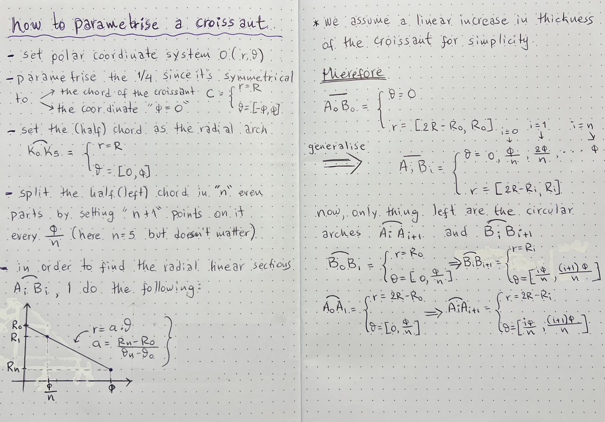

`Set the rules or parametric constraints that could allow you to represent this jummy croissant in a digital medium.`  
`- explain what you understand of what is parametric`  
`- define the set of rules to represent the figure`

## some theory..  
 - what is parametric?  
Without much scientific support, the way I understand the term "parametric" is as a method of describing a subject that **carries its relationships and interdependencies** with other objects of the same system.  

- parametric croissant   
There are countless ways to describe a croissant in a parametric way. more abstract, interpretative, more literally, more scientifically. Even if one chooses the mathematical way, there are still plenty of different principles to follow. This time I chose to try and follow the 'scientific' / 'mathematical' way, because it seemed quite paradoxical and therefore very interesting·  

how can a totally abstract, non-constant, 'shapeless' shape fit into the strict rules of maths?  
..seemed like a good opportunity to awaken my 'once upon a time' mathematical knowledge..  

but still, with my average background in maths, which has been left untouched since high school, I definitely needed some backup. Not having spoken to my brother Giannis for a while, i decided to ask for his help and collaboratively solve this problem. The following result had a lot of his input, as he is a nerdy high tech engineer who loves a playful problem-solving.  

## some math..   

   

   

## some 'aftermath' 
After intrpreting th croissant with the strict mathematical rules, here are some playful experimentations with rhino  

  

