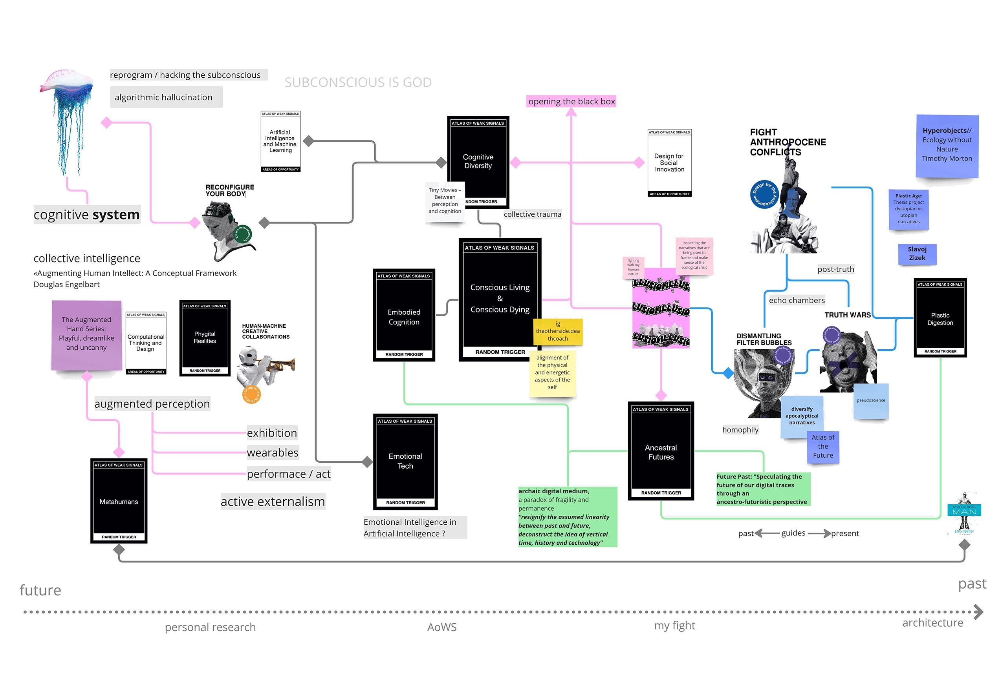

---
hide:
    - toc
---
# [Atlas of Weak Signals](https://fablabbcn.github.io/mdef-docs/academic_year_2022_23/term_1_2022_23/atlas_of_weak_signals_2022_23_%28aows%29/)  
track: Reflexion  

### BOARD TIMELINE

Starting from my architectural background, I was introduced from the early years of my studies to the process of creative thinking, to building strong concepts and ideas with a more pragmatic and technical aspect. I always used storytelling as a medium to develop a new project that addresses the mega-phenomena around us. Coming from a semi-technical school, I also discovered the power of technology and its fascinating physical and digital outcomes.

THESIS
The milestone of my past academic experience is my thesis project called "Plastic Age" which was
developed with my colleague Maria. The project triggers the ecological crisis we are experiencing and the ways humans are trying to control it. In essence, the project is a alternative narrative about the plastic accumulation on the planet, that questions and redefines the notion of nature. By seeing plastic as a "hyperobject", we created a plastic city, built by its own waste products. A new layer of plastic covered the ancient city and gradually started spreading around the world. In this entirely artificial era, nature as we know it is nothing but an ancestral monument. By playfully flirting between dystopic and utopic approach, we tried to discover new qualities within this supposedly tragic scenario.

Coming to today, while configuring my current fight and its multiple dimensions, I came across to the concept of filter bubbles. Having already a background in questioning the "common truths" about the environment, I projected this point of view generally on the ideological isolations we live in. The AoWS card game gave me a storm of new interesting topics, some more relevant to my previous approach, some less. Cards like "Dismantling filter bubbles", "Truth Wars", "Fight Anthropocene conflicts" and "Ancestral Futures" immediately caught my eye and selected them as the base of my story.
(At this point I felt stuck in over-observing and critically evaluating ideas, trying to find meaning, instead of focusing in finding new inputs).
While trying to collect the full spectrum of my interests for my board, I tried to retrieve information from my deeper personal self, which I never dared to explore or include in my projects / experiments.
I have always been intrigued by the way human brain and body function as a whole and form our behaviours, habits and our being. While reading the book "The Road the Less Travelled" by M. Scott Peck, I came across the notion "Subconscious is God" and it stayed in my mind ever since. I didn't know how and if it could be relevant to my work but I decided to write it as an interest anchor. After attending a presentation about collective trauma in AI, I dived into long-drawn research about subconsciousness, spirituality and trauma and a whole new area of design opportunities opened up for me.  

I Realized that it somehow connects with my initial fight about the illusionary world and the filter bubbles from the atlas.

It's all about going deeper in knowing and understanding.

Many new questions were raised:
How can we bring ourselves closer to our subconscious and the richness of information that is there encrypted?
How is the cognitive gap between the areas of our brain related to the humanitarian conflicts? How could instinctive negative or aggressive emotions be dismantled ?
How can technology help to all that?

I might be getting into deep waters with no background whatsoever and I don't know where this will take me, but I know I am curious and excited to explore it as much as I can.

