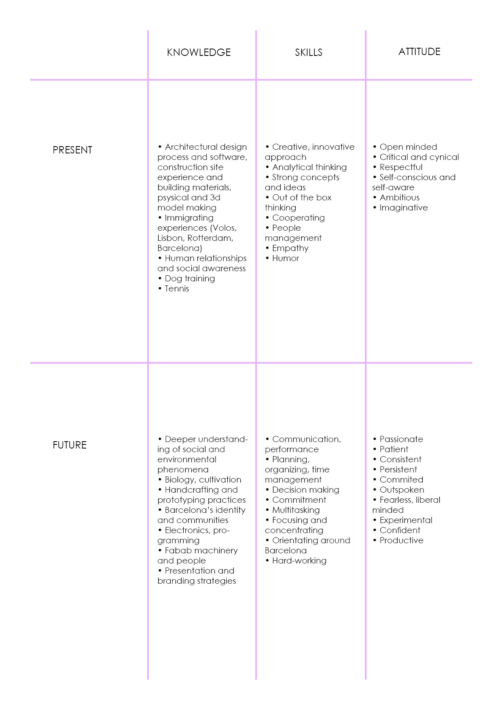

# Bootcamp
track: Application
click [here](https://fablabbcn.github.io/mdef-docs/academic_year_2022_23/term_1_2022_23/mdef_bootcamp_2022_23/) to see more about the course  

## vision - inspiration - goals

## fight
We are trying to get rid of the sicknesses of our society just by throwing them away, out of our field of view, out of our field of perception. And then we think that they actually disappeared.

*“One of the main problems of contemporary society, is that we’ve been gradually trying to make the remainders, the waste, the detritus disappear. At Earth magnitude, you’re not making it disappear at all. You’re only moving it from one place to another on the globe (...) Every town on Earth should have a well-monitored, protected, yet visible, amount of plutonium right in the middle of the town square. Visible, not hidden. It’s a matter of pragmatic urgency. Because if you hide it, if you put it underground, it’s going to leach into the groundwater. And no matter how many warning signs you erect, they will eventually decay and no one will understand them or remember what they are. Putting plutonium underground is like leaving a piece of broken glass on the carpet. So instead, we should make a nice sculpture out of the broken glass and put it on view. That means we directly own the fact that we made the plutonium. I don’t think a major revolution would be required to achieve this (...) We don’t have to change all of society first. What we have to do first is actually change society by simply refusing to move the dirt somewhere else (...) True nature includes plastics, garbage, things that smell and are not apparently beautiful and compatible.”*  
-Timothy Morton in Dark Ecology

We all live in our own bubbles, constructed by our set of values and beliefs and we criticize what
deviates the ‘right path’.  

*“Ecology is taking more and more the role of a conservative ideology. Its really the implicit premise of ecology that the existing world is the best possible world which is disturbed by human hubris and that nature is a harmonious, organic, balanced , reproducing, almost living organism which is then disturbed, perturbed, derailed though human hubris, technological exploitation.”*
-Slavoj Zizek in Examined life

Treating nature as something that is not amenable to change, does not adapt to the developments of the time, remaining frozen in an image of harmony and “natural beauty” is connected to an ecological concept that needs to be redefined.

Driven by the our need to be problem-solvers and saviours of the world, we come up with “solutions” which then bring new problems that we could not have imagined or predicted. For example, when plastic was first created, it was a true revolution, an apocalypse. It solved every problem and limitation of the existing materials: cost, weight, free-forming, fast production etc. But no one could have
foreseen what new problems it would bring a few decades later.
John Christopher says: *“To design is no longer to increase the stability of the man-made world: it is to alter, for good or ill, things that determine the course of its development”* In essence, the “design as change” definition is just a more realistic version of the “design as problem-solving argument.
By acknowledging our limitations, we actually create the space to iterate and test our design work
- because we know it can’t be perfect.

## personal ID

## personal development

