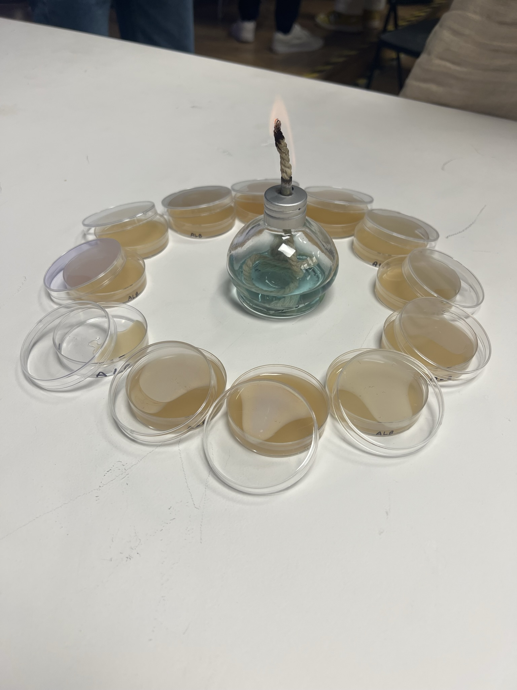

# Bio & Agri Zero   
## Track: Exploration

click [here](https://fablabbcn.github.io/mdef-docs/academic_year_2022_23/term_1_2022_23/biology_%26_agri_zero_2022_23/) to see the structure of the course  

### Article

### Experiments

During the course we had the chance to create our own H~2~O DIY experiments, which was 
### Team work
