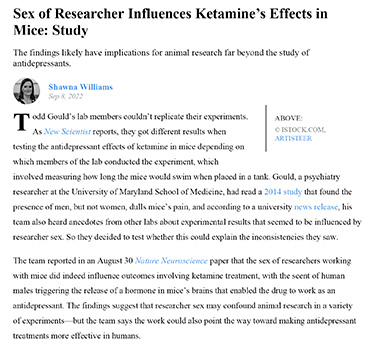

# Bio & Agri Zero
track: Exploration

click [here](https://fablabbcn.github.io/mdef-docs/academic_year_2022_23/term_1_2022_23/biology_%26_agri_zero_2022_23/) to see the structure of the course  

### Article
"Sex of Researcher Influences Ketamine's Effects in Mice"

### Experimenting  
  

During the course we had the chance to perform our own DIY experiments in 4 groups and apply the theory we were taught in practice. With the guidance of Nuria and Jordi, we created from scratch the lab conditions to test our hypothesis, which we then shared and compared with those of the other groups:

1. Microorganisms
We created a sterile environment and prepared sterile petri dishes. Then we made the auxitic media for lactobacillus and collected microorganisms from our environment. After one night in the warm incubator, they had already visibly colonized the dishes...  

2. Bioplastics  
To my surprise, bioplastic is a very easy and simple material to "cook" in only a few minutes by only 3 ingredients: hydrogen, alcohol and carbon chain. After preparing our apple infused plastic mix, we poured it into the molds and the next day we had our first DIY soft and sparkly bioplastics.  

3. Microscopy  
Our introduction to the micro-world. We had the chance to use 4 different microscopes and prepare the slide samples of fish embryos. It was very impressive to see with one's own eyes so much detail in living organisms. Also interesting was the technical side of the microscope and the way it produces such magnification with the reflexion of the light.  

3. PH paper  

4. Spirulina and Kombucha  

To some extent we faced the challenges of practicing experiments, like the critical importance of working with high accuracy and recording **every** detail and variable during the process. In this way, the knowledge  we gained was more empirical, collective and definitely more enjoyable.  

### *Team* work makes the *dream* work
  
While projecting our dirty skin on the laptop through the electronic microscope...   amazingly disgusting   

Team: Claudia, Korbinian, Myrto, Stella (Claudia behind the camera)
