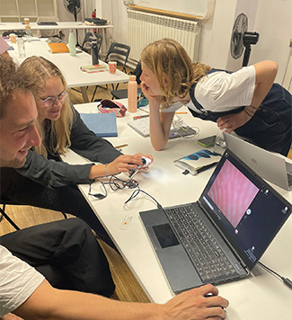

# Bio & Agri Zero
track: Exploration  

click [here](https://fablabbcn.github.io/mdef-docs/academic_year_2022_23/term_1_2022_23/biology_%26_agri_zero_2022_23/) to see more about the course  

## Experiments  
  
Drying the auxetic sterile dishes

During the course we had the chance to perform our own DIY experiments in 4 groups and apply the theory we were taught in practice. With the guidance of Nuria and Jordi, we created from scratch the lab conditions to test our hypothesis, which we then shared and compared with those of the other groups:

1. Microorganisms
We created a sterile environment and prepared sterile petri dishes. Then we made the auxetic media for lactobacillus and collected microorganisms from our environment. After one night in the warm incubator, they had already visibly colonized the dishes...  

2. Bioplastics  
To my surprise, bioplastic is a very easy and simple material to "cook" in only a few minutes by only 3 ingredients: hydrogen, alcohol and carbon chain. After preparing our apple infused plastic mix, we poured it into the molds and the next day we had our first DIY soft and sparkly bioplastics.  

3. Microscopy  
Our introduction to the micro-world. We had the chance to use 4 different microscopes and prepare the slide samples of fish embryos. It was very impressive to see with one's own eyes so much detail in living organisms. Also interesting was the technical side of the microscope and the way it produces such magnification with the reflexion of the light.  

3. PH paper  
Our experiment here was about
4. Spirulina and Kombucha  

To some extent we faced the challenges of practicing experiments, like the critical importance of working with high accuracy and recording **every** detail and variable during the process. In this way, the knowledge  we gained was more empirical, collective and definitely more enjoyable.  

## Article: "Sex of Researcher Influences Ketamine's Effects in Mice"  

Todd Gould’s lab members **couldn’t replicate** their experiments.  
As New Scientist reports, they got different results when testing the antidepressant effects of ketamine in mice depending on which members of the lab conducted the experiment, which involved measuring how long the mice would swim when placed in a tank. Gould, a psychiatry researcher at the University of Maryland School of Medicine, had read a 2014 study that found the presence of men, but not women, dulls mice’s pain, and according to a university news release, his team also heard anecdotes from other labs about experimental results that seemed to be influenced by researcher sex. So they decided to test whether this could explain the inconsistencies they saw.  
The team reported in an August 30 Nature Neuroscience paper that the sex of researchers working with mice did indeed influence outcomes involving ketamine treatment, with **the scent of human males triggering the release of a hormone in mice’s brains that enabled the drug to work as an antidepressant. The findings suggest that researcher sex may confound animal research in a variety of experiments**.  
*“Our findings in mice suggests that activating a specific stress circuit in the brain may be a way to improve ketamine treatment”*  Gould says in the university announcement.
The researchers also delved into the mechanisms behind that effect, and found that when men administered ketamine to the mice, a hormone called corticotropin-releasing factor (CRF) was released in an area of the mouse hippocampus associated with depression, enabling the ketamine’s antidepressant effect. This didn’t happen when women administered the drug unless they accompanied the ketamine with a dose of CRF.
Gerlinde Metz of the University of Lethbridge in Canada tells New Scientist that researcher sex is **just one of many variables** that can affect animal experiments; others include their shipment to the lab, diet, and even the season. She says researchers should try to control for the effects of these variables as best they can, although it may be **impossible** to do so completely.  

- https://www.newscientist.com/article/2337160-the-sex-of-the-researcher-can-influence-results-of-mouse-experiments/  
- https://www.the-scientist.com/news-opinion/sex-of-researcher-influences-ketamine-s-effects-in-mice-study-70468  

## Article reflection  
At first, this article caught my attention by its title. The gender-relation in mice experiments sounds unexpected and interesting as an observation but this is not the reason I chose to use it for the assignment. Out of all the experience I had in class, I strongly remember Nuria stressing out the importance of keeping track of the experiment's conditions, the exact ingredients of the recipes and all variables that can affect the results. And I realized that even when we know them all and try to be precise, it is still very hard to replicate every step of such a complex procedure.   Having already had a first glimpse in performing experiments,
## *Team* work makes the *dream* work
  
While projecting our dirty skin on the laptop through the electronic microscope...   amazingly disgusting   

Team: Claudia, Korbinian, Myrto, Stella (Claudia behind the camera)
