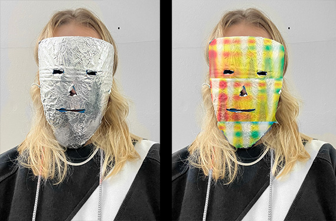

# [Living With Your Own Ideas](https://fablabbcn.github.io/mdef-docs/academic_year_2022_23/term_1_2022_23/living_with_your_own_ideas_2022_23/)  
track: Reflection    

## inVISIBLE me  
Make a living / non-living companion  

   

- *How will you live together?*  
The wearable mask will be tied around and covering my face. It consists of a base made out of plastic soap bottle and an external layer of aluminium foil, which will be changing.   
It works as an extension of the face, a piece of clothing. It can adapt its surface according to the situation.  

- *What does it notice?*  
It notices my personal needs while interacting with people and transforms the material, the face expressions or any kind of message I want to give to my surroundings by transforming its outer layer.  

- *What were you thinking?*   
My wishful superpower has always been the ability to disappear and become temporarily invisible. To some extent it is related to my need for control over my appearance, my body, myself. Our face is like a screen which projects personal information even in unwanted situations. Even the characteristics of one's face, regardless of the expression can cause prejudiced and biased reactions. My aim was to somehow protect - address - test the above situations on a personal but also on a social level.  

- *Why does it matter?*  
The 'mask' is a very primitive yet contemporary object with a great history in multiple fields: We can see is as an object for performing arts, rituals, punishment, disguise, fashion, hygiene etc. This idea of mask attempts to become an integral part of the self in daily life which will open new communication channels with the surroundings and bring comfort in uncomfortable situations.    

After wearing the mask and moving around the city for a whole afternoon, I noticed the following **contradictions**:  
- comfort in hiding *vs* discomfort in breathing  
- liberating expression *vs* limiting communication  
- sense of protection *vs* opportunity for exposure    
- attention avoidance (eg random unwanted acquaintances) *vs* attention catcher (it looks quite creepy)  

## time-zero challenge  
Exercise brief:  
- *How can you take action on your topic in a brave way?*  
- *Can you make some small piece of your idea and live with it?*  
- *How can you probe the design space through an embodied / first-person exploration?*  
- *Can you create a situation that might reveal something new?*  

According to the task timeframe, we were given one and a half day to complete the exercise, meaning to come up with an idea, start applying it, document it and present it in a 1-minute video. Everything had to be done very quickly, which for me and my personal rhythm was just unimaginable. The topics of my interest for the time being are quite abstract, vague and seemingly unrelated with each other. So in order to come up with a challenge concept which is directly related to my topics and fulfils the assignment requirements, I needed at least one week. And then one more week to plan the application of the idea, and finally one more to edit the video.   
Obviously this was just not possible.  
Therefore I started thinking in a 'reversed' way:  
• What if my biggest struggle on the assignment (and in life) becomes the idea I have been looking for?
• What happens if I **act** instead of think?   
• What would my day look like if I have **zero** time to think?   
• How would I **react** to my daily stimuli without any processing or analysing?  
• Is it possible to forcedly **interrupt** the thinking process (at least the conscious one) and how can I do it?    

The moment this idea came to my mind, I immediately started applying it.  
At the same time, some of my classmates were asking for my help in their own projects. I gave myself 2-3 seconds to decide and reply, which led me to a very intense, uncontrolled and versatile day.  
I got dressed in 5 seconds to go for padel (I went out wearing my pyjama top). Then I joined two classmates at the beach where I helped in shooting videos for their projects. When we finished I went to Elisava for a quick meeting (couldn't have been long since it would interrupt my no-thinking process). At that moment I realised I hadn't thought of charging my phone, so my documentation capabilities were also limited. While unceasingly applying this challenge during my day, I also came up with 3 mini-challenges within the main one:  
• 10-minute weekly groceries  
• 20-minute nonstop writing  
• no recipe baking (I do not know how to cook / bake / make food)   

At the end of the day I was physically and mentally exhausted.  
Click [here](https://vimeo.com/manage/videos/767849850?embedded=false&source=video_title&owner=188260103) to see the video  

## Reflection  
(still writing)

- *What did you make? And why did it matter?*  
Taking my time to think and process before acting is my comfort zone. What I did was an experiment to force myself out of this comfort zone, to expose my instinctive and unprocessed thoughts/actions. It was a risk which I wouldn't have taken otherwise.  

- *What happens when you involve yourself?*  
I always thought that my projects were somehow self-involving, but now I realise it has actually been quite distant from my inner self. This experience of self-involvement is definitely the strongest, with all the good and not so good aspects of it. On the one hand, the project became more important,....  

- *What happens when you use yourself as an instrument?*  
The experience and the outcomes are embodied: the most powerful, long-lasting way of knowledge. It somehow changes a part of your being and consequently your practice as a designer. The outcome is a new, authentic, genuine, undeniable point of view.  

- *Did anything change about your way of working?*  
Everything! It was actually the complete opposite.  

- *What does it mean for your future work?*  

- *After seeing the videos of your design space collective, how does it change your understanding of it, present new opportunities or inspire new possibilities for collaboration?*  
