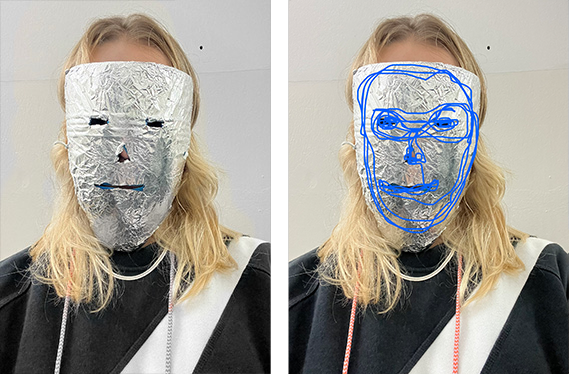

# [living with your own ideas](https://fablabbcn.github.io/mdef-docs/academic_year_2022_23/term_1_2022_23/living_with_your_own_ideas_2022_23/)  
`track: Reflection`    

## inVISIBLE me  
Make a living / non-living companion  

   

- *How will you live together?*  
The wearable mask will be tied around and covering my face. It consists of a base made out of plastic bottle covered in a layer of aluminium foil which will be transforming.   
It works as an extension of the face, like a piece of clothing. It can adapt its surface depending on the situation.  

- *What does it notice?*  
It notices my personal needs when interacting with people and transforms the material, the face expressions or any kind of message I want to communicate to the surroundings through its outer layer.  

- *What were you thinking?*   
My wishful superpower has always been the ability to disappear and become temporarily invisible. To some extent it is related to my need for control over my appearance, my body, myself. The face is like a screen which projects personal information even in unwanted situations. At the same time, the pure characteristics of the face regardless of the expression can cause prejudiced and biased reactions. My aim was to somehow protect - address - test the above situations on a personal and on a social level.  

- *Why does it matter?*  
The 'mask' is a very primitive yet contemporary object with a great history in multiple fields: It can be used an object for performing arts, rituals, punishment, disguise, fashion, hygiene etc. This particular idea of mask attempts to become an integral part of the self in daily life which will open new communication channels with the environment and bring comfort in uncomfortable situations.    

### Companion reflection  

After wearing the mask and moving around the city for a day, I noticed the following **contradictions**:  
- comfort in hiding *vs* discomfort in breathing  
- liberating expression *vs* limiting communication  
- sense of protection *vs* opportunity for exposure    
- attention avoidance (eg random unwanted acquaintances) *vs* attention catcher (it looks quite creepy)  

## 24h challenge  
Exercise brief:  
- *How can you take action on your topic in a brave way?*  
- *Can you make some small piece of your idea and live with it?*  
- *How can you probe the design space through an embodied / first-person exploration?*  
- *Can you create a situation that might reveal something new?*  

### time-zero
According to the task timeframe, we were given one and a half day to complete the exercise, meaning to come up with an idea, start applying it, document it and present it in a 1-minute video. Everything had to be done very quickly, which for me and my personal rhythm was just unimaginable. The topics of my interest (for the moment) are quite abstract, vague and seemingly unrelated to each other. So in order to come up with a concept directly related to my topics and matching the assignment requirements, I needed at least one week. And then another week to plan the application of the idea, and then one more to prepare the video.   
Obviously this was not even close to possible.  
Therefore I started thinking in a 'reversed' way:  
• What if my biggest struggle on the assignment (and in life) **becomes the idea** I have been looking for?   
• What happens if I **act** instead of think?   
• What would my day look like if I have **zero time** to think?   
• How would I **react** to my stimuli without any sort of processing?  
• Is it possible to forcefully **interrupt** the thinking process (at least the conscious one) and how can I do it?    

The moment this idea came to my mind, I immediately started applying it.  
At the same time, my classmates started asking for help in their own projects. I gave myself 2-3 seconds to decide and reply, which led me to a very intense, uncontrolled and versatile day.  
I got dressed in 5 seconds to go for padel (I wore my pyjama top). Then I went to the beach where I helped in shooting some videos for other projects. When we finished the shooting I went to Elisava for a quick meeting with Oscar (couldn't have been long since it would interrupt my no-thinking process). On that moment I realised I hadn't thought of charging my phone, so my documentation capabilities were also limited.  
While unceasingly applying this challenge during my day, I also came up with 3 mini-challenges within the main one:  
• 10-minute weekly groceries  
• 20-minute nonstop writing  
• no recipe fast baking (zero cooking / baking knowledge)   

At the end of the day I was physically and mentally exhausted.  

  <iframe loading="lazy" style="position: absolute; width: 100%; height: 100%; top: 0; left: 0; border: none; padding: 0;margin: 0;"
    src="https:&#x2F;&#x2F;www.canva.com&#x2F;design&#x2F;DAFRM6IaMuE&#x2F;watch?embed" allowfullscreen="allowfullscreen" allow="fullscreen">
  </iframe>

<a href="https:&#x2F;&#x2F;www.canva.com&#x2F;design&#x2F;DAFRM6IaMuE&#x2F;watch?utm_content=DAFRM6IaMuE&amp;utm_campaign=designshare&amp;utm_medium=embeds&amp;utm_source=link" target="_blank" rel="noopener">TIME-ZERO challenge</a> by Myrto-Eirini Pappa  

### challenge reflection  

- *What did you make? And why did it matter?*  
Taking time to think and process before acting has always been my **comfort zone**. What I did was an experiment to force myself out of it, to expose my instinctive, unprocessed thoughts and actions. Living in fast-pace and losing control over my life is a great fear and a risk I wouldn't have taken easily.  

- *What happens when you involve yourself?*  
I always thought that my projects were somehow self-involving, because I have always been truthful to what I want to represent. Nevertheless, I realise that I have always been keeping a certain distance from involving my inner self with the fear of getting too self-inclusive. After having performed my first experiment with a deeper self-involvement I value the process differently: there are no longer strong distinctions between the 'work', the 'personal life', the 'hobbies', the 'free time' etc. Everything **blends** and overlaps with one another, creating a whole **interconnected** mass. And this feels way more **human**.     

- *What happens when you use yourself as an instrument?*  
 When the source of knowledge is your own body, the result is more powerful and long-lasting. It somehow changes a part of your being, and consequently your design practice. The outcome is an authentic, **genuine**, undeniable point of view which can not be predetermined.  
 Nevertheless there are always two sides: I got passionate and excited but also more frustrated. I was not able to switch to another subject or just take a break since I was the designer and I was the "guinea pig".  

- *Did anything change about your way of working?*  
(still writing)  
The way Ι worked that day was the complete opposite of what I'm used to. I tried to switch from being extremely slow and indecisive, to being extremely fast and direct. What I realised was that 'time' is a luxury which can either reinforce or prevent the project's development. Having plenty of time can be helpful in building confidence and deeper understanding on the work, but at the same time it might be confusing: Analysing every possibility leads to information overload and procrastination, which misguides and disconnects the project from the original penchant. From my experience, both 'extremes' come with their own set of implications. My goal is to find the right balance between the two and be able to switch modes according to my needs.    

- *What does it mean for your future work?*  
- *After seeing the videos of your design space collective, how does it change your understanding of it, present new opportunities or inspire new possibilities for collaboration?*   
to be discovered..  
