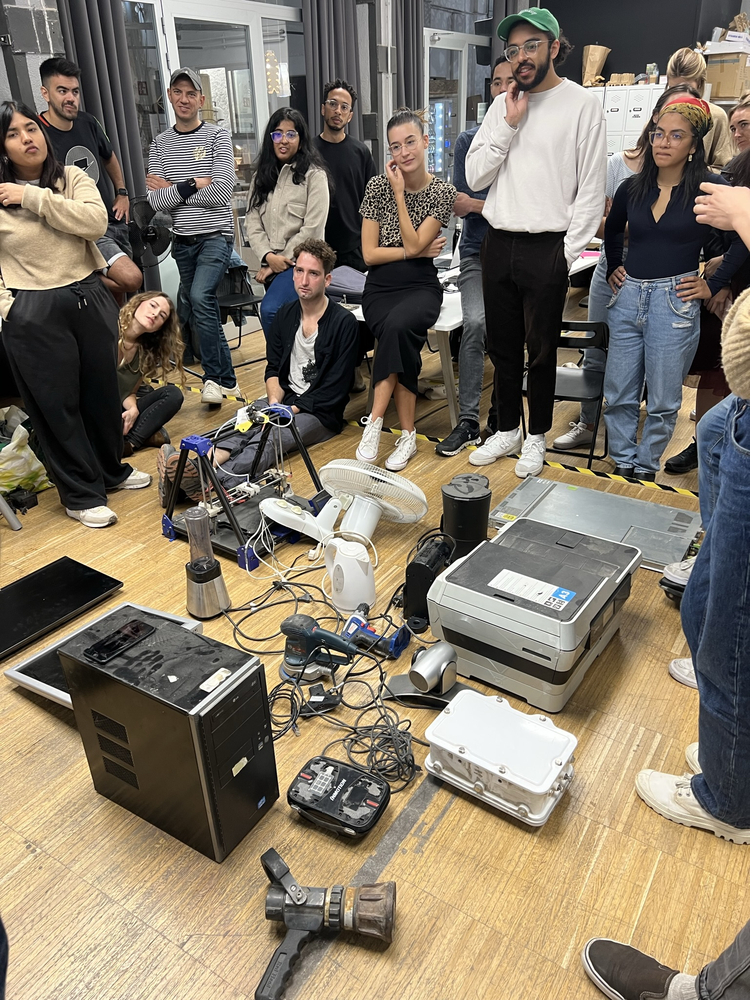

# [Tech Beyond The Myth](https://fablabbcn.github.io/mdef-docs/academic_year_2022_23/term_1_2022_23/tech_beyond_the_myth_2022_23/)  
track: Instrumentation  

## part 1: disassembling -> identifying  
  
The two-week course "Tech beyond the myth" started with the intimidating challenge of disassembling an old electronic device, which for my team was **two** LCD screen monitors: A DELL 2015 and a Philips 2007 model.  
We unscrewed every single piece that could possibly be unscrewed, we peeled off the parts that were glued and we even had to break parts that were designed not to be accessible by the users. After collecting all the pieces we tried to identify them: their function, their origin, their interconnectivity and more.

  

Later on, we developed our research in 4 main levels:      
- Political / ethical  
- Technical / analytical  
- Material resources   
- After life  

https://hackmd.io/6Gz_caxaSM-UFo9HLMk4tw

## part 2: reassembling -> creating
