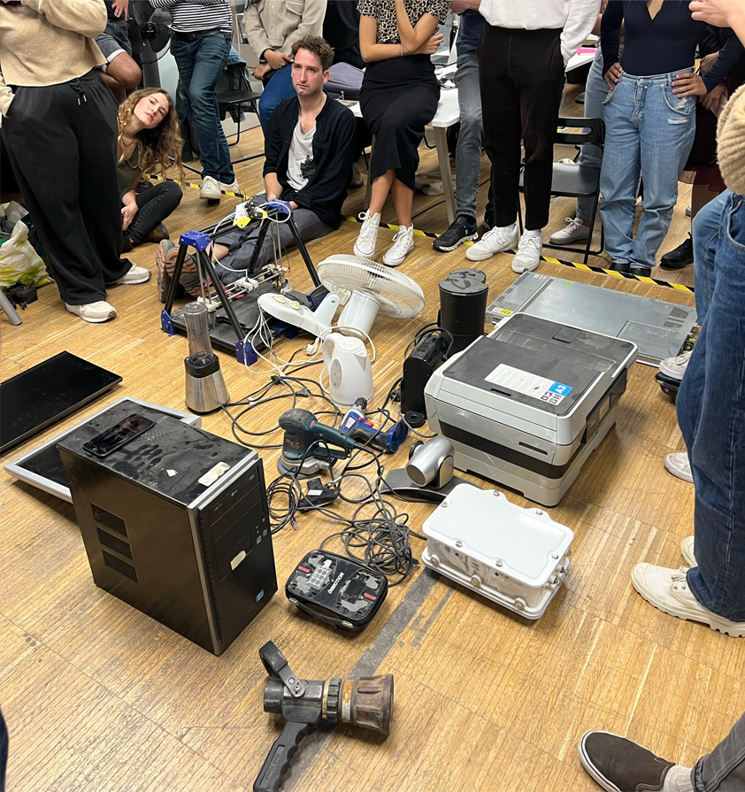
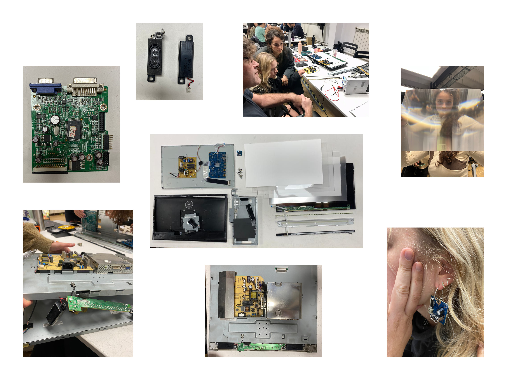

# [Tech Beyond The Myth](https://fablabbcn.github.io/mdef-docs/academic_year_2022_23/term_1_2022_23/tech_beyond_the_myth_2022_23/)  
track: Instrumentation  

## 1. Disassembling -> Identifying  

  
The two-week course "Tech beyond the myth" started with the intimidating challenge of disassembling an old electronic device, which for my team was **two** LCD screen monitors: A DELL 2015 and a Philips 2007 model.  
We unscrewed every single piece that could possibly be unscrewed, we peeled off the parts that were glued and we even had to crack damage some parts that were designed not to be accessible by the users. After collecting all the pieces we tried to identify their function, their origin, their interconnectivity and more.
  

We developed our research in 4 different levels:      
- Technical: How does it work?  
- Material resources: Where and how are chips they manufactured?  
- Political: Why are they 'black boxes'?     
- After life: Can PCBs be recycled?  

For me it was the first time I explored the inside of such a complex electronic machine so the process of demystification was surprising. It was a great challenge for me to understand the technical function of the screen, but I was also very lucky having the right people around me to patiently explain me what I could not find online. Because what I realised from my personal research is that highly complex and technical information on the internet is usually created in order to be understood by experts on the field, which proved the well-known perception of technology as 'black box'. I realise that one can not become an engineer in two weeks and what we discovered was just a teeny-tiny glimpse of how electronics work. But even these baby steps that we made changed our approach towards technology and opened new channels of experimentation.  

click [here](https://hackmd.io/6Gz_caxaSM-UFo9HLMk4tw) to view our forensic report

## 2. Reassembling -> Creating
Once we gained a good base of theoretical knowledge about those devices, the fun part started: Testing the function of the components isolated and bringing them back to life. The parts that we chose to focus on were the speakers and the LEDs  

<iframe src="https://docs.google.com/presentation/d/e/2PACX-1vRXRer_4LkwNSSRSiP6Ro8_FdwRp9BHXNzIQmxz3BfKbHeDDZMHWxm6gaH_CFEr-JNS2SFxAeDB-icy/embed?start=false&loop=false&delayms=3000" frameborder="0" width="960" height="569" allowfullscreen="true" mozallowfullscreen="true" webkitallowfullscreen="true"></iframe>

*Unfortunately during the second week of the course I got sick and I was unable to participate physically to the second part of the project.  
I am very grateful to my lovely team that worked hard and created this beautiful 'almost useless machine'.*  

`Team: Amanda, Claudia, Myrto, Stella
